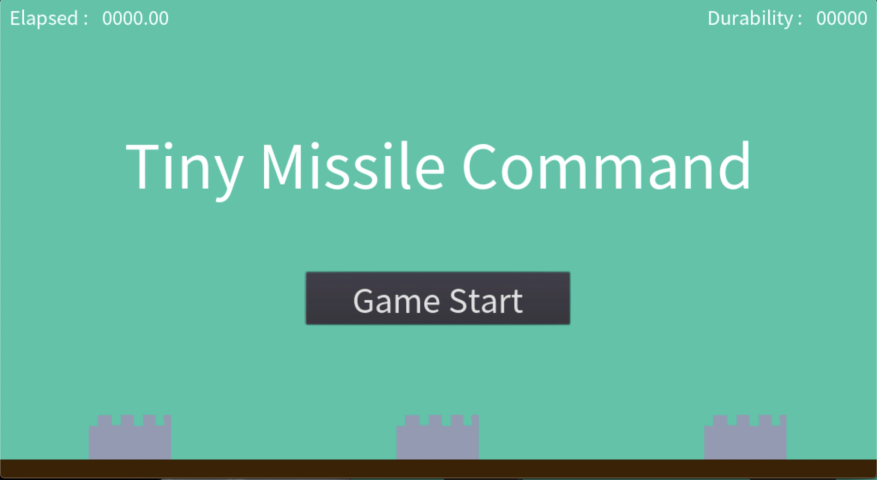
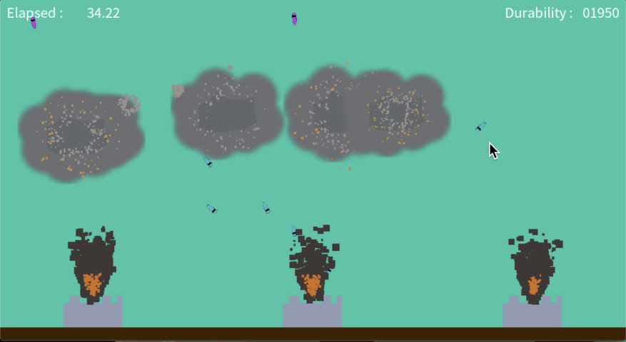

Tiny Missile Command
====================

It's my first game using Godot Engine.

https://tanupoo.github.io/missilecommand/tmc.html

Exported to HTML5 so that you can play it in your both PC and mobile.

It's something different as I made it by only my memory.
But, it's a similar game to Missile Command by ATARI,
which was one of my favorite game at that time.

    
    

===

Godot Engineのチュートリアルをざっとなめてから使ったゲーム。

https://tanupoo.github.io/missilecommand/tmc.html

記憶を頼りにATARIの「ミサイルコマンド」をイメージしながら作ってみた。

作ってからググると当時の画像が見つかった。
大体あってる😬

https://www.retrogamer.net/retro_games80/missile-command/

あと、さらにググると Androidにリメイク版があった。

https://play.google.com/store/apps/details?id=com.atari.mobile.missilecommandmc

プロが作るとさすがに違う😖
